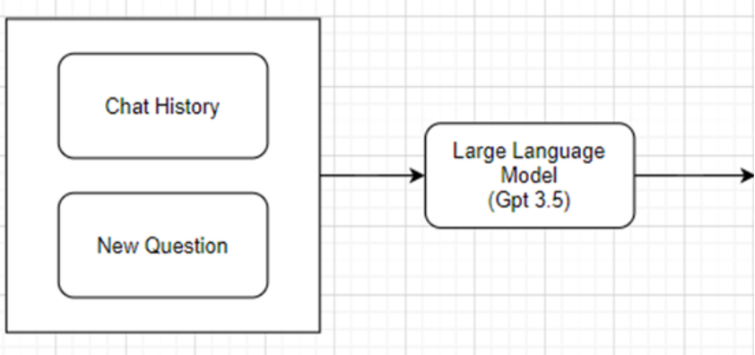

# 학사 안내 챗봇 향림이

---


## ⚙️ 주요기능

---

- 질문에 맞는 학사 정보를 답변해줍니다.
- 챗봇이 참고 자료를 확인 확인할 수 있습니다.
- 학사정보 뿐만 아니라, 다양한 질문도 답변이 가능합니다.

## 💻 사용 기술

---

- ````TypeScript```` `Node.js` `Next.js` `LangChain` `GPT-3.5 Turbo`

## 🗓️ **작업기간**

---

- **2023.03 ~ 2023.11**

## 👨‍💻 팀원

---

- **`정보통신공학과`** `20184303` **`이지표`**
- **`정보통신공학과`** `20184303` **`최진영`**
- **`정보통신공학과`** `20184303` **`김영준`**
- **`정보통신공학과`** `20184303` **`신규원`**

## 🖥️ 작동 화면

---

<div>
  
  
</div>


## 🛠️ 시스템 아키텍처

---


## 🔥 개발 동기

---

- **편의성 제공**
    - 학생들이 정보를 쉽게 검색하고 접근할 수 있도록 도와줍니다.
    - 학생들은 인터넷 검색 엔진에서 찾기 어려운 정보들을 챗봇을 통해 쉽게 검색할 수 있습니다.
- **시간과 비용 절감**
    - 챗봇이 교직원들의 답변을 대신해주기 때문에 시간과 비용을 절약할 수 있습니다.
- **정보 업데이트 용이성**
    - 챗봇 실시간으로 업데이트함으로써 신속하게 학생들에게 정보를 전달할 수 있습니다.
- **데이터 수집과 분석**
    - 학생들이 자주하는 질문과 관심사항에 관한 데이터를 수집하고, 분석하여 인사이트를 도출하는데 활용할 수 있습니다.

## 🤖 챗봇의 종류

---

- **트랜잭션 챗봇**
    - 가장 일반적으로 사용되는 유형의 챗봇입니다.
    - 작업 지향적 또는 선언적 챗봇이라고 하며, 하나의 기능을 수행하거나 자동화하는 데 주력하는 단일 용도의 챗봇 입니다.
    - 대화형으로 설계된 자동 응답을 생성합니다.
    - 일반적인 작업이나 문제를 미리 알고 있는 비지니스에 유용합니다.

- **대화형 챗봇**
    - 대화형 챗봇은 보다 개인 맞춤화 된 상호 작용에 사용되는 정교한  챗봇입니다.
    - 인공지능, 자연어 처리, 지식 데이터베이스, 기타 정보에 엑세스 하여 사용자의 질의 응답에서 뉘앙스를 감지하고 인간과 동일한 방식으로 관련 답변을 제공합니다.
    - 현재까지 국내 대학교에서 대화형 챗봇을 도입한 곳은 없는 것으로 조사됩니다.
- **학사 안내 챗봇 향림이는 다양한 질문에 대응하고, 인간과 동일한 방식으로 관련된 답변을하는 대화형 챗봇으로 개발되었습니다.**

## 📚 학사 자료 범위

---

- **학교 홈페이지**와 **설문 조사**를 기반으로 학사 자료 범위를 설정하였습니다.
- **학교 홈페이지 조사**
    
    
    
- **설문 조사**
    
    
    
- 가장 많은 **휴복학**, **수강신청**, **출석**, **장학**, **학점인정** 등 을 기준으로 답변할 수 있도록 범위를 설정하였습니다.

## 📝 챗봇 학습

---

- **GPT 학습**
    - GPT (Generative Pre-trained Transformer)는 대표적인 언어 모델 중 하나로, 전체적인 문맥과 언어 패턴을 학습하여 텍스트 생성, 번역, 요약, 질의응답 등의 다양한 자연어 처리 태스크에 뛰어난 성능을 보입니다.
    - GPT학습 종류는 크게 **pre-training**, **fine-tuning**, **in-context learning** 세가지가 있습니다.
    
    
    
- **Pre-training**
    - GPT의 pre-training은 대규모 텍스트 데이터셋에서 먼저 수행됩니다.
    - Pre-training 된 GPT 모델은 일반적인 자연어 처리 테스크에서 좋은 성능을 보입니다.
- **Fine-tuning**
    - Fine-tuning은 pre-trained된 GPT 모델을 특정 테스크에 맞게 fine-tuning하는 과정입니다.
    - Fine-tuning을 통해 GPT는 특정 태스크에서 더 높은 성능을 발휘할 수 있습니다.
- **In-context learning**
    - In-context learning은 GPT모델을 더 효과적으로 사용하기 위한 기술중 하나 입니다.
    - In-context learning은 명시적 lerning (model update)이 존재하지 않습니다.
    - In-context learning은 pre-training또는 fine-tuning 이후에도 추적인 학습을 통해 모델의 성능을 개선하는데 사용될 수 있습니다.
- **학습 자료와 비용에 한계가 있기에 in-context learning의 방식으로 학습을 진행했습니다.**

## 📜 프롬포트 엔지니어링

---

- 프롬포트 엔지니링(Prompt Engineering)은 생성 AI에게 품질 좋은 결과를 만드는 데 필요한 명렁어를 만드는 것을 의미합니다.
- 학사 안내 챗봇 향림이는 크게 ******Giving Instructions, Role Prompting, Standard Prompt****** 기법을 활용하여 프롬포트를 생성하였습니다.

<aside>
💡 **향림이 질문 Promot**


</aside>

## 💪맞이한 문제와 극복 과정

---

### 1️⃣**연속된 질문의 한계**

**한계**

- Open AI 사에서 GPT 를 사용할 수 있도록 api를 제공하고 있지만 세션을 계속 열지 않기에, 연속된 질문을 하더라도 그 전 질문의 내용을 모르기에 제대로 된 답변이 불가능 했습니다.

**해결 방법**

- 새로운 질문과 이전 질문의 기록으로 이전 질문에 독립적인 질문을 생성하도록 과정을 추가하였습니다.



```jsx
const CONDENSE_TEMPLATE = `[저번 대화 내용]과 [후속 질문]이 주어졌을 때 [후속 질문]을 [저번 대화 내용을 포함한 후속 질문]으로 바꾸어 보세요.
...
[저번 대화 내용] : {chat_history}
...
[후속 질문] : {question}
...
[저번 대화 내용을 포함한 후속 질문] :`;
```

### 2️⃣**부정확한 답변**

**한계**

- GPT특성상 문장을 생성하여 답변을 하기에 정확한 답변을 보장할 수 없었습니다.

**해결 방법**

- 챗봇이 참고한 자료를 제공하여, 정확한 정보인지 사용자가 확인할 수 있도록 하였습니다.


